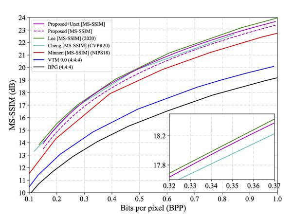
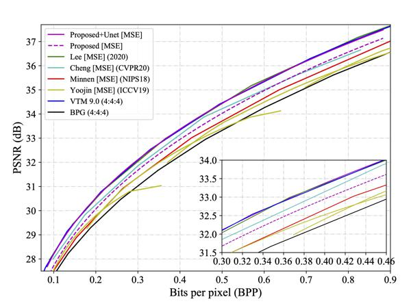
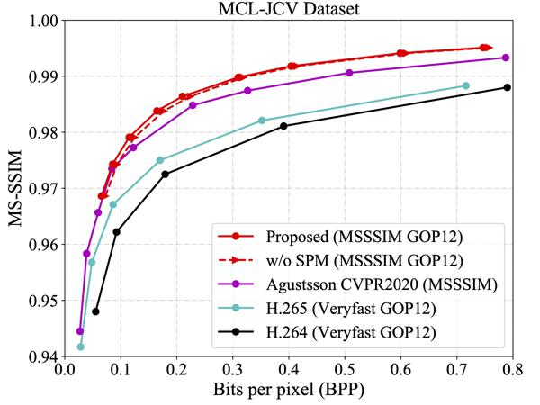
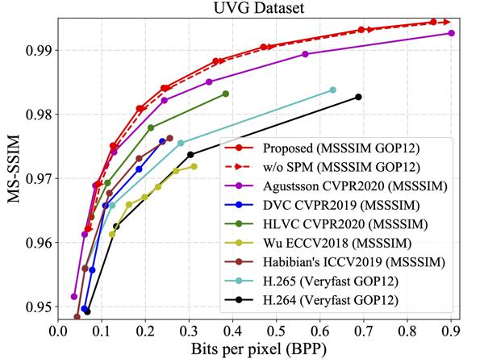
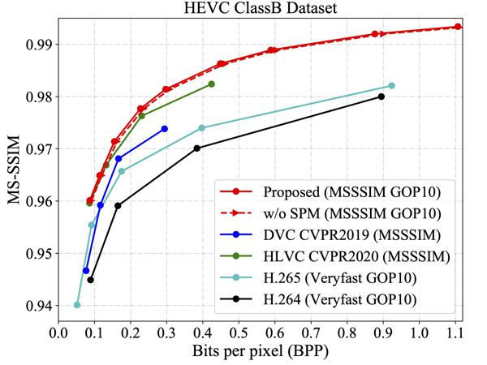
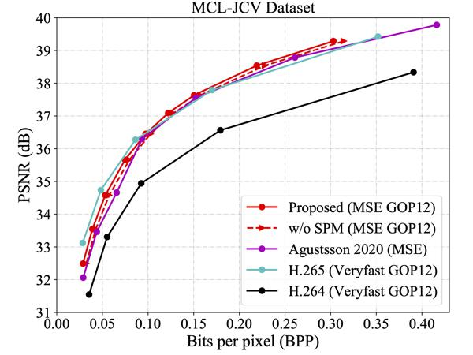
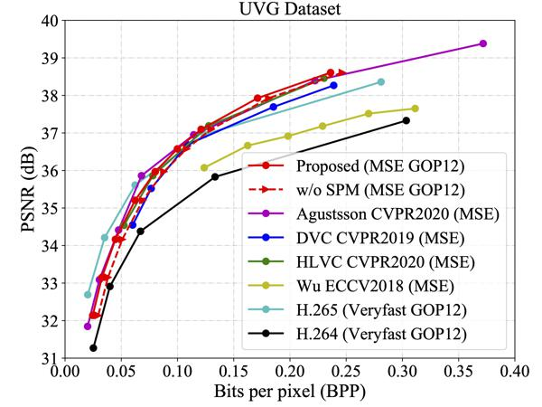
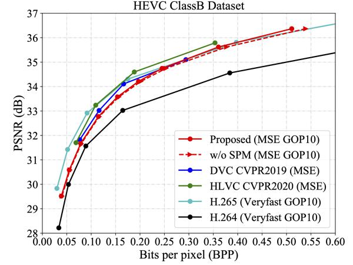

## Introduction


IPCodec is an open source entropy-based compression toolbox with **tensorflow 1.12.0**, which contains Interpolation Variable Rate (IVR) I-frame and P-frame compression models.

***
## License

This project is developed by Alibaba and licensed under the [Apache 2.0 license](LICENSE).

***
## Installation

### Prerequisites
* Linux
* Python 3.6+
* tensorflow 1.12.0
* CUDA 10.0+

### Prepare environment
1. Create a conda virtual environment and activate it.

    ```shell
    conda create -n tf12 python=3.6 -y
    conda activate tf12
    ```

2. Install other packages with the following command.

    ```shell
    pip install -r requirements.txt
    ```

***
## Easy to use
Use the [checkpoint/download.sh](checkpoint/download.sh) to download all pretrained models.
```shell
cd checkpoint
sh download.sh
```
### Train or test for image compression

  - If not use Unet post network, set is_post to False.
  - Download [Kodak](http://r0k.us/graphics/kodak/) test image to `dataset/kodak`

  ```shell
  python I_train.py/I_test.py --loss_metric PSNR --model_name CM \
  --is_post True  --with_context_model True  --is_multi True

  python I_train.py/I_test.py --loss_metric SSIM --model_name CM \
  --is_post True  --with_context_model True  --is_multi True

  python I_train.py/I_test.py --loss_metric PSNR --model_name NoCM \
  --is_post False  --with_context_model False  --is_multi True
  ```

### Train or test for video compression

  - If not use Unet post network, set is_post to False.
  - Convert video to PNG images to `test_set_dir` in `IP_config.py`.
  - `IP_test_multi.py` is the Multi videos processing script, need to carefully use it since the model_path is changed.

  ```shell
  python IP_train.py/IP_test.py --loss_metric PSNR --model_name STPM \
  --is_post True  --with_context_model True  --is_multi True --ckpt_dir_pre ./checkpoint/I_model/CM_PSNR  --idx_test 0

  python IP_train.py/IP_test.py --loss_metric SSIM --model_name STPM \
  --is_post True  --with_context_model True  --is_multi True --ckpt_dir_pre ./checkpoint/I_model/CM_SSIM  --idx_test 0

  python IP_train.py/IP_test.py --loss_metric PSNR --model_name NoSPM \
  --is_post True  --with_context_model False  --is_multi True --ckpt_dir_pre ./checkpoint/I_model/CM_PSNR  --idx_test 0
  
  python IP_train.py/IP_test.py --loss_metric SSIM --model_name NoSPM \
  --is_post True  --with_context_model False  --is_multi True --ckpt_dir_pre ./checkpoint/I_model/CM_SSIM  --idx_test 0
  ```

***
## Results
### Results for I-frame compression (Image compression) on Kodak Dataset.


### Results for P-frame compression (Video compression) on MCL-JCV, UVG, HEVC-ClassB Dataset.







**Note**:
If you find this useful, please support us by citing the following paper.
```
@inproceedings{ivr,
  title={Interpolation variable rate image compression},
  author={Sun, Zhenhong and Tan, Zhiyu and Sun, Xiuyu and Zhang, Fangyi and Qian, Yichen and Li, Dongyang and Li, Hao},
  booktitle={Proceedings of the 29th ACM International Conference on Multimedia},
  pages={5574--5582},
  year={2021}
}
```
```
@article{sun2021spatiotemporal,
  title={Spatiotemporal Entropy Model is All You Need for Learned Video Compression},
  author={Sun, Zhenhong and Tan, Zhiyu and Sun, Xiuyu and Zhang, Fangyi and Li, Dongyang and Qian, Yichen and Li, Hao},
  journal={arXiv preprint arXiv:2104.06083},
  year={2021}
}
```


***
## Main Contributors

[Zhenhong Sun](https://sites.google.com/view/sunzhenhong),[Dongyang Li](https://scholar.google.com.hk/citations?user=ko3eGS0AAAAJ), [Xiuyu Sun](https://sites.google.com/view/sunxiuyu).